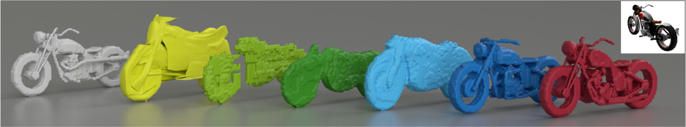
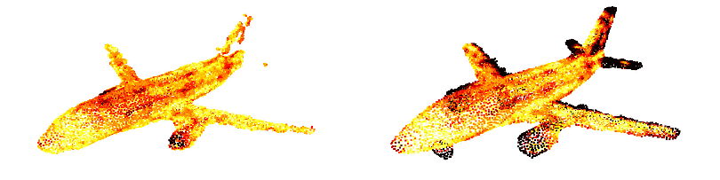

# What Do Single-view 3D Reconstruction Networks Learn?



Evaluation and visualization code accompanying the CVPR'19 [paper](https://lmb.informatik.uni-freiburg.de/Publications/2019/TB19/paper-s3d.pdf) "What Do Single-view 3D Reconstruction Networks Learn?" by M. Tatarchenko*, S. R. Richter*, R. Ranftl, Zhuwen Li,Vladlen Koltun, and Thomas Brox.

### Dependencies

* [Open3D](https://github.com/intel-isl/Open3D)
* numpy
* matplotlib

### Setup

If you want to use the F-score evaluation code, you need to first download the point clouds and the data specifications. Unpack them into your desired location and update the BASE_DATA_PATH variable in the path_config.py file with this location. The resulting structure of your data folder should look like

```
data/
    points/
    lists/
    classes.txt
```

If you want to run some additional experiments, you can also download other data modalities: voxel grids, renderings and viewpoint information.

### F-score evalution

### Precision/recall visualization



You can produce the precision/recall visualizations of your reconstructions similar to the one above by running

```
$ python vis.py --gt path_to_gt_cloud.ply --pr path_to_pr_cloud.ply
```

Point color denotes the point-to-point distance from low (white) to high (black). By default the scaling of the color map is determined automatically based on the maximum point-to-point distance between the two point clouds. Instead, you can additionally pass the `--th` parameter to the script. Its value will be used both as a maximum distance for color map scaling and as a threshold for F-score computation.

### Citation

If you use our code for your research, please cite the following papers

```
@inproceedings{what3d_cvpr19,
	author    = {Maxim Tatarchenko* and Stephan R. Richter* and René Ranftl and Zhuwen Li and Vladlen Koltun and Thomas Brox},
	title     = {What Do Single-view 3D Reconstruction Networks Learn?},
	journal   = {CVPR},
	year      = {2019},
}

@article{open3d_arxiv,
	author    = {Qian-Yi Zhou and Jaesik Park and Vladlen Koltun},
	title     = {{Open3D}: {A} Modern Library for {3D} Data Processing},
	journal   = {arXiv:1801.09847},
	year      = {2018},
}
```